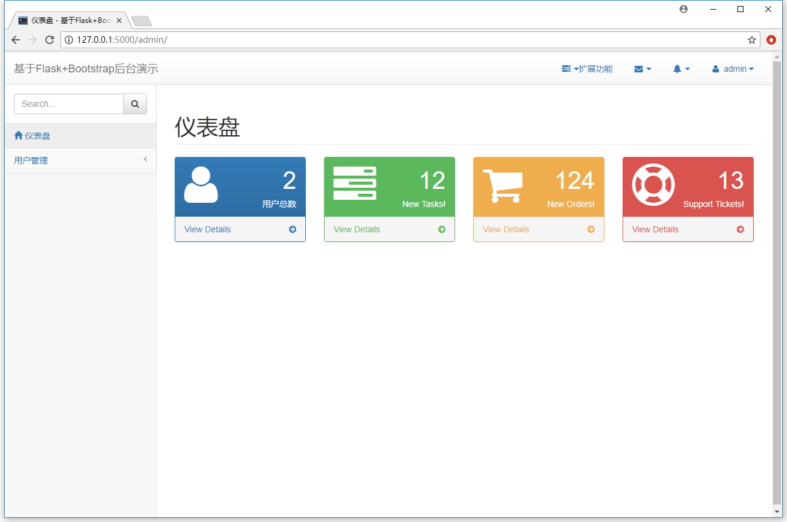

# flask web admin demo

flask web 后台模板

主要基于以下模块：

- flask-user
- flask-admin
- start-bootstrap-admin-2

# 快速开始

Windows PowerShell：

```PowerShell
python3 -m venv venv
.\venv\Scripts\activate
(venv) python -m pip install --upgrade pip
(venv) pip3 install -U setuptools
(venv) pip3 install -r .\requirements.txt
(venv) flask initdb
(venv) flask createsuperuser
(venv) flask run
```

# 效果图



