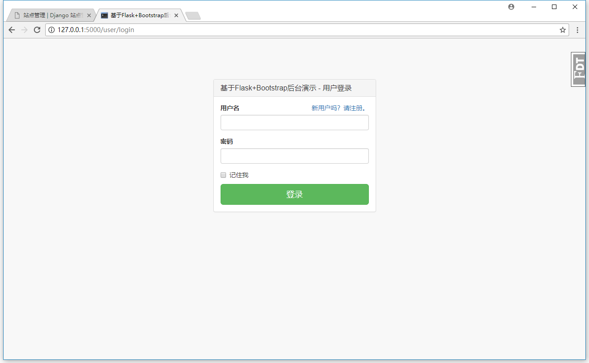

# flask web admin demo

flask web 后台模板

主要基于以下模块：

- flask-user
- flask-admin
- start-bootstrap-admin-2

## 快速开始

Windows PowerShell pip：

```PowerShell
python3 -m venv venv
.\venv\Scripts\activate
(venv) python -m pip install --upgrade pip
(venv) pip3 install -U setuptools
(venv) pip3 install -r .\requirements.txt
(venv) flask initdb
(venv) flask createsuperuser
(venv) flask run
```

Windows PowerShell pipenv：

```PowerShell
# option
$env:PIPENV_VENV_IN_PROJECT = "/path/to/project"
pipenv install
pipenv shell
flask initdb
flask createsuperuser
flask run
```

## 效果图




